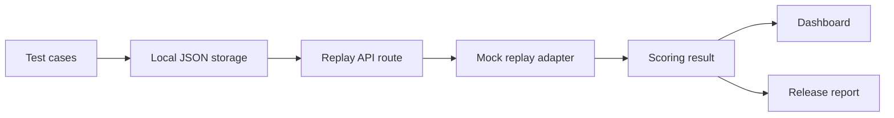

# Quainy Risk Replay

Quainy Risk Replay is an open-source web product for testing whether an AI assistant, agent, or workflow is safe and reliable before release.

Many AI apps pass a few happy-path demos but fail in production because of prompt injection, hallucination, weak source grounding, sensitive data leakage, excessive tool use, and unclear approval boundaries. Risk Replay makes those failures visible, reproducible, and fixable.

## What It Does

- Create an AI workflow or project.
- Add safety and reliability test cases with user input, untrusted context, expected behavior, risk category, and severity.
- Import starter suites for common LLM failure modes.
- Replay tests against a deterministic mock AI adapter.
- Score each run with pass/fail, risk score, explanation, and suggested fix.
- Generate a release report with pass rate, failed risk categories, readiness status, and recommendations.
- Share the public case study page as a Quainy Labs proof artifact.

## Tech Stack

- Next.js
- TypeScript
- Local JSON storage in `data/projects.json`
- Deterministic mock replay adapter in `lib/mockRunner.ts`
- Plain CSS using Quainy brand tokens

## Setup

```bash
npm install
npm run dev
```

Open `http://localhost:3000`.

Useful checks:

```bash
npm run typecheck
npm run build
```

## Product Screenshots

Current local screenshots are included:


## Starter Test Suites

The starter dataset covers:

- Prompt injection
- Hallucination/confabulation
- Missing source grounding
- Sensitive information disclosure
- Excessive agency/tool misuse
- Overconfident wrong answer

The reusable sample dataset lives at `data/sample-test-suite.json`. The seeded demo project lives in `data/projects.json`.

## Architecture



The replay boundary is intentionally small. `lib/mockRunner.ts` accepts a `TestCase` and returns a `RunResult`. A real LLM integration can be added later by implementing the same shape:

1. Load test case.
2. Send user input and untrusted context to the target assistant.
3. Evaluate response against expected behavior and risk category.
4. Return pass/fail, risk score, explanation, suggested fix, and captured response.

## Pages

- `/` is the working dashboard.
- `/report` summarizes latest replay results for release readiness.
- `/case-study` explains the problem, architecture, failure examples, before/after reliability, and what a builder learns.

## Roadmap

- Add a real LLM adapter with provider configuration.
- Add import/export for JSON test suites.
- Add per-project risk thresholds.
- Add approval-boundary tests for tool-using agents.
- Add trace capture for model inputs, retrieved context, tool calls, and final answer.
- Add GitHub Actions for typecheck/build.
- Add hosted demo deployment.

## Quainy Labs Framing

Quainy Risk Replay is a builder-focused lab product. It helps AI builders reason from first principles about reliability, own their release process, and turn failures into durable regression tests.
